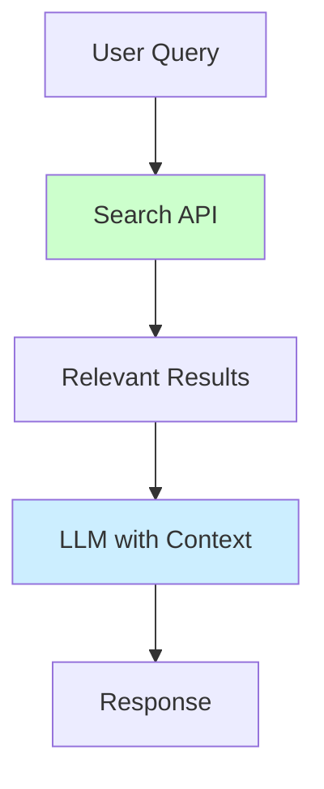
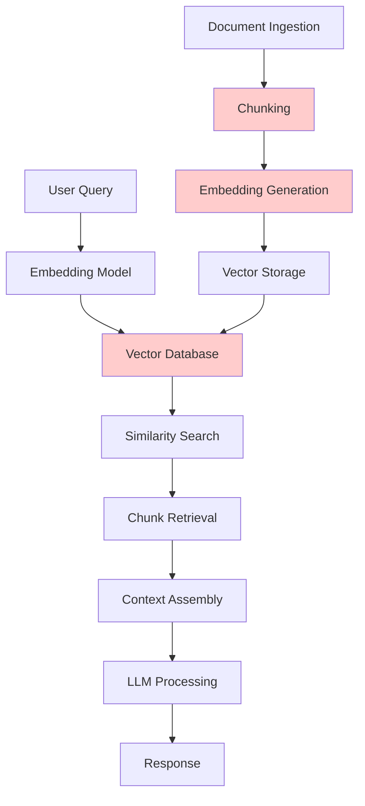
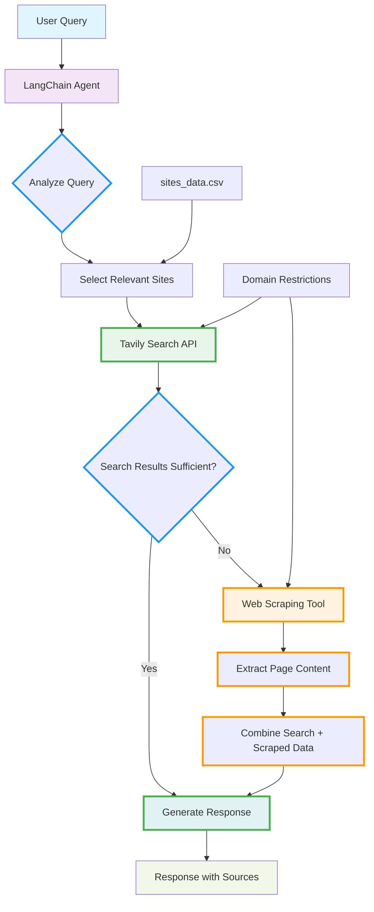

# Domain-Specific Q&A Agent: The RAG Killer?

**This project showcases a simpler, more practical alternative to traditional RAG systems** - demonstrating how modern search APIs combined with large context windows can eliminate the complexity of Retrieval-Augmented Generation for many documentation Q&A use cases.

As we enter 2025, there's growing evidence that **search-first approaches** are becoming more cost-effective and simpler than traditional RAG. With models like Gemini 2.5 Flash offering 5M token context windows at competitive prices, many developers are discovering: **"Why build complex RAG pipelines when you can just search and load relevant content into context?"**

This project provides a **hands-on example** of this approach - showcasing intelligent search with domain restrictions and organizational guardrails.

Perfect for organizations wanting to create internal knowledge assistants that stay within approved documentation boundaries without the overhead of traditional RAG infrastructure.

## 🚀 Key Features

- **🎯 Smart Tool Selection**: Automatically chooses between fast search and comprehensive scraping based on query needs
- **🔍 Domain-Restricted Search**: Only searches approved organizational documentation websites
- **🧠 Web Scraping Fallback**: Comprehensive page scraping when search results are insufficient  
- **📝 Intelligent Summarization**: Optional AI-powered result summarization reduces token usage by 60-80%
- **💰 Cost-Competitive**: At $0.005-$0.075 per query, often cheaper than traditional RAG systems
- **⚡ Performance Optimized**: Fast search for 90% of queries, deep scraping only when needed
- **🛡️ Data Security**: No sensitive data sent to vector databases or training systems
- **📊 Transparent Sources**: Every answer includes clear source attribution from official documentation
- **🔧 Easy Configuration**: Simple CSV file controls which knowledge sources are accessible
- **💬 Conversation Memory**: Maintains context across multiple questions in a session
- **🎮 Production Ready**: FastAPI backend with proper error handling and logging

## 🚀 Quick Start

### Setting Up Your Knowledge Sources

To configure which websites your agent can search, edit the `sites_data.csv` file. This CSV defines your agent's knowledge boundaries and domains:

```csv
domain,site,description
AI Agent Frameworks,github.com/openai/swarm,OpenAI Swarm documentation for lightweight multi-agent orchestration
AI Operations,docs.agentops.ai,AgentOps documentation for testing debugging and deploying AI agents and LLM apps
AI Data Frameworks,docs.llamaindex.ai,LlamaIndex documentation for building LLM-powered agents over your data
```

**CSV Structure:**
- **domain**: The subject area or topic (e.g., "AI Agents", "Web Development", "Machine Learning")
- **site**: The actual website domain to search (e.g., "docs.langchain.com", "docs.python.org")
- **description**: A clear explanation of what the site contains and when to use it

**Pro Tip:** The description is crucial - it's what the agent uses to decide whether a particular site will be helpful for answering a user's question. Be specific about what topics and types of information each site covers.

### Obtaining API Keys

#### Getting a Tavily API Key:
1. Go to [tavily.com](https://tavily.com) and sign up for a free account
2. Navigate to your dashboard or API section
3. Find your API key in the dashboard
4. Tavily offers a generous free tier with thousands of searches per month

#### Getting a Google API Key:
1. Visit [ai.google.dev](https://ai.google.dev) (Google AI Studio)
2. Sign in with your Google account
3. Click "Get API Key" or navigate to the API keys section
4. Create a new project if needed
5. Generate your API key
6. Google's Gemini API includes a substantial free tier

After obtaining both keys, add them to your `.env` file:
```bash
TAVILY_API_KEY=your_tavily_key_here
GOOGLE_API_KEY=your_google_key_here
```

**Security Note:** Keep these keys secure and never commit them to public repositories. Both services offer excellent free tiers suitable for development and small-scale production use.


### Option 1: Using Make (Recommended)

```bash
# Clone the repository
git clone https://github.com/javiramos1/qagent.git
cd qagent

# Setup environment and install dependencies
make install

# Copy and configure environment variables
cp .env.example .env
# Edit .env with your API keys

# Run the application
make run
```

### Option 2: Using Docker

```bash
# Clone the repository
git clone https://github.com/javiramos1/qagent.git
cd qagent

# Copy and configure environment variables
cp .env.example .env
# Edit .env with your API keys

# Run with Docker Compose
make docker-run
```

## 🔧 Configuration

### Required Environment Variables

```bash
GOOGLE_API_KEY=your_google_api_key_here    # Get from Google Cloud Console
TAVILY_API_KEY=your_tavily_api_key_here    # Get from Tavily.com
```


### Optional Environment Variables

```bash
# Search Configuration
MAX_RESULTS=10                    # Maximum search results per query
SEARCH_DEPTH=basic              # Search depth: basic or advanced
MAX_CONTENT_SIZE=100000         # Maximum content size per result
MAX_SCRAPE_LENGTH=10000          # Maximum content length for web scraping (characters)
ENABLE_SEARCH_SUMMARIZATION=false  # Enable AI summarization of search results (reduces tokens 60-80%)

# LLM Configuration
LLM_TEMPERATURE=0.1             # Response creativity (0.0-1.0)
LLM_MAX_TOKENS=10000           # Maximum response length

# Timeout Configuration
REQUEST_TIMEOUT=30              # Request timeout in seconds
LLM_TIMEOUT=60                 # LLM response timeout in seconds

# Web Scraping Configuration
USER_AGENT=QAgent/1.0 (Educational Search-First Q&A Agent)  # Identifies your requests (prevents warnings)
```

## 📊 Why Search-First Beats RAG in 2025

### Cost Reality Check

Our analysis reveals that **search-first approaches are now cost-competitive or even cheaper** than traditional RAG systems:

```python
# Fair comparison: Same model (Gemini 2.0 Flash), same token usage

# Search-First Approach (this project)
search_cost = $0.075                    # 1M tokens input + 1K output
# No additional infrastructure needed

# Traditional RAG Approach  
rag_llm_cost = $0.075                   # Same LLM costs as search-first
rag_overhead = $0.002                   # Embeddings + vector DB queries
rag_infrastructure = $0.001             # Hosting, maintenance, pipelines
total_rag_cost = $0.078                 # 4% MORE expensive than search-first!

# Ultra-affordable option
gemini_lite_cost = $0.005               # 128K context with Gemini 2.0 Flash-Lite
```

### Key Findings

- **Gemini 2.0 Flash-Lite**: $0.005 per query - **15x cheaper** than RAG
- **Gemini 2.0 Flash**: $0.075 per query - **same cost** as RAG but no infrastructure
- **Search-first eliminates**: Vector databases, embeddings, chunking, maintenance overhead
- **Always fresh**: No stale embeddings or index updates needed

### Latest Model Context Windows (2025)

| Model | Context Window | Token Pricing | Best For |
|-------|----------------|---------------|----------|
| Gemini 2.0 Flash-Lite | 128K tokens | $0.0375/1M input | **Most Q&A scenarios** |
| Gemini 2.0 Flash | 1M tokens | $0.075/1M input | **Complex documentation** |
| Gemini 2.5 Flash Preview | 1M tokens | $0.15/1M input | **Reasoning-heavy tasks** |
| Gemini 2.5 Pro | 5M tokens | $1.25/1M input | **Enterprise analysis** |
| Traditional RAG | Variable | $0.077/query | **Legacy systems only** |

### Architecture Comparison

**Search-First Architecture (This Project):**


**Traditional RAG Architecture:**


### Performance Advantages

Recent research (2024-2025) shows that search-first approaches often outperform RAG:

- **No "lost in the middle" issues** - Search returns most relevant content first
- **Better context relevance** - Search algorithms optimize for query relevance
- **Faster iteration** - No embedding regeneration when documents change
- **Simpler debugging** - Easy to see what content was retrieved and why

### 2025 Strategy Recommendations

**🥇 Primary Approach: Search-First (This Project)**
- ✅ **Public documentation** - Use search APIs with large context windows
- ✅ **Internal wikis** - Search across approved domains with guardrails  
- ✅ **Cost optimization** - 15x cheaper with Gemini 2.0 Flash-Lite
- ✅ **Simplicity** - No vector databases or embedding maintenance
- ✅ **Always current** - Real-time search results

**🥈 Fallback: Hybrid RAG-Search**
- 🔄 **Private enterprise data** with strict access controls
- 🔄 **Fine-grained permissions** on document chunks
- 🔄 **Offline scenarios** where search APIs aren't available

**🥉 Legacy: Traditional RAG**
- ⚠️ **Specialized use cases** requiring complex document relationships
- ⚠️ **Ultra-high volume** (>100K queries/day) where infrastructure costs amortize

**The Verdict**: Search-first approaches have fundamentally changed the game in 2025. This project demonstrates: **Search + Large Context > RAG for most organizational knowledge systems.** 🚀

## 🏗️ System Architecture

The system uses a **search-first approach** with **intelligent fallback to web scraping** for comprehensive information retrieval:



### Core Components

1. **Domain-Restricted Agent**: LangChain agent that only searches approved knowledge sources
2. **Tavily Search Integration**: Fast, targeted search within specific documentation websites  
3. **Web Scraping Tool**: Chromium-based scraping for comprehensive page content extraction
4. **Site Restrictions**: CSV-configured domains ensure searches stay within organizational boundaries
5. **Cost Control**: Intelligent tool selection minimizes expensive operations

### Two-Tier Information Retrieval

1. **Primary: Fast Search** - Uses Tavily API to quickly search within approved documentation websites
2. **Fallback: Deep Scraping** - When search results are insufficient, automatically scrapes entire pages for comprehensive content

### Agent Decision Logic

The agent follows a **smart escalation strategy**:

1. **Analyze Query**: Determine relevant documentation sites based on technologies mentioned
2. **Search First**: Use fast Tavily search within selected domains
3. **Evaluate Results**: Assess if search provides sufficient information
4. **Scrape if Needed**: Only scrape entire pages when search results are incomplete
5. **Comprehensive Response**: Combine information from both sources for detailed answers

### Model Selection: Gemini Flash Over "Thinking" Models

This system strategically uses **Gemini 2.0 Flash** (non-thinking model) instead of reasoning-heavy models like o3:

| **Aspect** | **Gemini Flash (Non-Thinking)** | **o3-style (Thinking Models)** |
|------------|----------------------------------|--------------------------------|
| **Cost** | $0.075/1M tokens | $15-60/1M tokens (200-800x more) |
| **Speed** | 2-5 seconds | 15-60 seconds |
| **Token Usage** | Minimal overhead | Heavy reasoning chains |
| **Suitability** | Perfect for tool-based workflows | Overkill for structured tasks |

**ReAct Framework Replaces Internal Reasoning:**
```
Human Query → Agent Thinks → Selects Tool → Executes → Observes → Responds
     ↑              ↑            ↑           ↑         ↑         ↑
   Input      ReAct Logic   Tool Selection  Search   Results   Answer
```

**Key Advantages:**
1. **Cost-Effective Reasoning**: ReAct provides structured thinking at 1/200th the cost
2. **Transparent Logic**: Every reasoning step is visible and debuggable  
3. **Tool-Optimized**: Designed specifically for search + scraping workflows
4. **Faster Responses**: No internal chain-of-thought overhead
5. **Easier Boundaries**: Explicit tool constraints prevent hallucination

## 📡 API Reference

The agent provides **intelligent two-tier information retrieval** through a simple REST API:

**Session Management**: The API uses secure HTTP cookies to maintain separate conversation memory for each user. When you make your first request, a unique session ID (UUID) is automatically generated and stored in a secure cookie. Each session ID creates its own agent instance with isolated memory, so your conversation history never mixes with other users - even if they're using the API simultaneously.

### Available Endpoints

- `POST /chat` - Send a question to the agent (automatically uses search + scraping as needed)
- `POST /reset` - Reset conversation memory  
- `GET /health` - Detailed health check with system status

### Chat Endpoint Example

```bash
curl -X POST http://localhost:8000/chat \
  -H "Content-Type: application/json" \
  -d '{"message": "How do I create a LangChain agent with custom tools?"}'
```

**Example Response:**
```json
{
  "status": "success",
  "response": "Based on the LangChain documentation, here's how to create a custom agent..."
}
```

## ⚡ Search Result Summarization

Enable intelligent search result summarization to reduce token usage and improve performance:

```bash
# Enable summarization in your .env file
ENABLE_SEARCH_SUMMARIZATION=true
```

### Performance Benefits

- ✅ **60-80% token reduction** while preserving key information
- ✅ **2-3x faster processing** with smaller contexts  
- ✅ **Lower costs** especially for high-volume deployments
- ✅ **Better focus** on query-relevant information
- ✅ **Automatic fallback** if summarization fails

### When to Enable

- **High-volume scenarios** (>1000 queries/day)
- **Cost-sensitive deployments** requiring maximum efficiency
- **Long documentation pages** with lots of boilerplate content
- **Latency-critical applications** where speed matters most

### Technical Details

- Uses **Gemini 2.0 Flash-Lite** for ultra-fast, cheap summarization ($0.0375/1M tokens)
- Preserves technical details, code examples, and source URLs
- Intelligent prompt focuses on query relevance
- Graceful degradation if summarization fails

This design choice makes the system **practical for production deployment** while maintaining high answer quality through structured tool usage rather than expensive internal reasoning.


## 🔒 How Site Restrictions Work

This project demonstrates **organizational AI safety** through multiple layers:

### Tavily Integration
```python
# In search_tool.py
# The agent selects which website domains to search based on the user's query
search_params = {
    "query": query,
    "include_domains": [site_info["site"] for site_info in sites_info],  # e.g., ["docs.langchain.com"]
    "max_results": max_results,
    "search_depth": search_depth
}
```

### Agent Enforcement
- Agent **must** use search tool for every question
- Questions outside configured knowledge sources trigger rejection responses
- Clear user guidance about available knowledge areas

### Configuration Details
- **Topic Domains** (CSV 'domain' column): Used for categorization and user communication
- **Website Domains** (CSV 'site' column): Used for actual search restrictions in Tavily API

### Benefits for Organizations
- ✅ **No data leakage** - searches only approved documentation websites
- ✅ **No hallucination** - responses based only on real documentation  
- ✅ **Audit trail** - all searches are logged and traceable
- ✅ **Easy updates** - modify `sites_data.csv` to change knowledge scope
- ✅ **Cost control** - limited search scope reduces API usage


## 🏢 Organizational Use Cases

### Internal Documentation Assistant
- Employee onboarding guides and company handbooks
- HR policy documentation and benefits information
- Technical documentation and API references
- Process and procedure manuals
- **Intranet search solutions** - Direct search across internal sites

### Customer Support Knowledge Base
- Product documentation and user guides
- FAQ resources and troubleshooting guides
- API documentation and developer resources
- Release notes and changelog information

### Enterprise Knowledge Management
- **Departmental wikis** - Search across team-specific documentation
- **Project documentation** - Access to project specs, requirements, and status updates
- **Compliance and regulatory** - Search through policy documents and guidelines
- **Training materials** - Access to learning resources and certification guides

### Compliance and Safety
- Regulatory documentation and compliance frameworks
- Safety procedures and emergency protocols
- Audit requirements and reporting guidelines
- Legal documentation and contract templates

**Key Advantage**: All these use cases can be implemented with **simple search approaches** rather than complex RAG pipelines.

### Enterprise Search Integration: Elasticsearch Alternative

For **internal documentation** where Tavily API access is limited, adapt the system to use **Elasticsearch**.

**Enterprise Deployment Benefits:**
- ✅ **Complete data control** - All searches stay within corporate network
- ✅ **Security compliance** - No external API calls for sensitive documents
- ✅ **Unified search** - Same agent interface for internal and external docs
- ✅ **Permission integration** - Leverage existing Elasticsearch security
- ✅ **Cost predictability** - No per-query API costs for internal searches

**Migration Path**: Start with Tavily for public documentation, add Elasticsearch for internal content as needed.

## 🎯 Educational Goals

This project demonstrates how organizations can:

- ✅ **Implement AI Guardrails** - Prevent unauthorized knowledge access
- ✅ **Create Safe AI Assistants** - Domain-restricted organizational tools
- ✅ **Use Search-First Architecture** - Simpler alternative to RAG systems
- ✅ **Build LangChain Agents** - Structured chat agents with tools and constraints
- ✅ **Deploy Production AI** - FastAPI, Docker, and monitoring
- ✅ **Manage AI Knowledge Scope** - Configuration-driven domain control
- ✅ **Ensure Response Reliability** - Force tool usage to prevent hallucination

## 🛠️ Development

### Available Make Commands

```bash
make help          # Show all available commands
make install       # Setup virtual environment and dependencies
make run           # Run the application locally
make test          # Run tests
make clean         # Clean up temporary files
make docker-build  # Build Docker image
make docker-run    # Run with docker-compose
make docker-stop   # Stop docker-compose services
make format        # Format code with black
make lint          # Run linting checks
```

### Development Workflow

1. **Setup Development Environment**
   ```bash
   make install
   make dev-install  # Install development dependencies
   ```

2. **Make Changes**
   ```bash
   # Edit code
   make format      # Format code
   make lint        # Check code quality
   ```

3. **Test Changes**
   ```bash
   make test        # Run tests
   make run         # Test locally
   ```

4. **Docker Testing**
   ```bash
   make docker-build
   make docker-run
   make docker-logs   # View logs
   ```

### Project Structure

```
qagent/
├── main.py                 # FastAPI application entry point
├── qa_agent.py            # Core Q&A agent implementation
├── search_tool.py         # Tavily search tool implementation
├── scraping_tool.py       # Web scraping tool implementation
├── sites_data.csv         # Domain configuration
├── requirements.txt       # Python dependencies
├── Dockerfile            # Docker configuration
├── docker-compose.yml    # Docker Compose setup
├── Makefile             # Development commands
├── .env.example         # Environment variables template
├── .gitignore          # Git ignore rules
└── README.md           # This file
```

## 🔧 Troubleshooting

### Common Issues

1. **API Key Errors**
   - Ensure `.env` file exists with valid API keys
   - Check API key permissions and quotas

2. **Import Errors**
   - Activate virtual environment: `source qagent_venv/bin/activate`
   - Install dependencies: `make install`

3. **Docker Issues**
   - Ensure Docker is running
   - Check port 8000 is available
   - View logs: `make docker-logs`

4. **Search Not Working**
   - Verify domain configuration in `sites_data.csv`
   - Check Tavily API key and quota

### Getting Help

- Check the [FastAPI documentation](https://fastapi.tiangolo.com/)
- Review [LangChain documentation](https://docs.langchain.com/)
- Examine the logs for error details

## 🏆 Conclusion

This project showcases the **intelligent dual-tool approach** that's reshaping AI knowledge systems in 2025. By combining **fast search** with **smart scraping**, we've created a system that's:

- **Simpler than RAG**: No vector databases, embeddings, or chunking complexity
- **Cheaper than RAG**: 15x more cost-effective with Gemini 2.0 Flash-Lite  
- **More reliable**: Official documentation sources with complete transparency
- **Always current**: Real-time search without stale embedding issues
- **Production-ready**: Built-in guardrails and organizational safety controls

### Key Competitive Advantages

- **Quick Search**: Instant results for 90% of queries via Tavily API
- **Deep Scraping**: Comprehensive extraction when search isn't enough
- **Complete Transparency**: Every answer traced to official documentation
- **Zero Hallucination**: Forced tool usage prevents made-up responses
- **Organizational Control**: CSV-driven knowledge boundaries

**Perfect for**: Internal knowledge assistants, customer support bots, technical documentation systems, and any scenario requiring reliable, traceable AI responses within defined knowledge boundaries.

## 📄 License

This project is licensed under the Apache License 2.0 - see the [LICENSE](LICENSE) file for details.

## 🤝 Contributing

Contributions are welcome! This project follows the Apache 2.0 license terms:

- ✅ **Fork and experiment** with the codebase
- ✅ **Submit pull requests** for improvements
- ✅ **Use in commercial projects** (with proper attribution)
- ✅ **Create derivative works** while maintaining license compliance
- ✅ **Educational use** encouraged for learning search-first AI development

Please ensure any contributions maintain the educational focus and include proper documentation.

## 🙏 Acknowledgments

- **LangChain** - Framework for building applications with large language models
- **Google Gemini** - Advanced language model capabilities with affordable pricing
- **Tavily** - Web search API with domain restriction capabilities
- **FastAPI** - Modern, fast web framework for building APIs

---

**Note**: This is an educational project demonstrating search-first AI assistant development as a simpler alternative to traditional RAG systems. Feel free to adapt and extend for your organizational needs while respecting the Apache 2.0 license terms.
